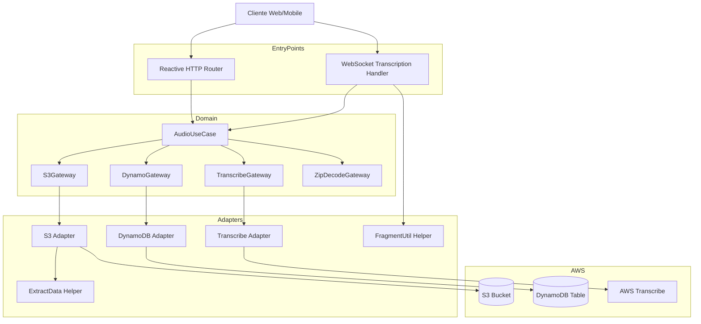
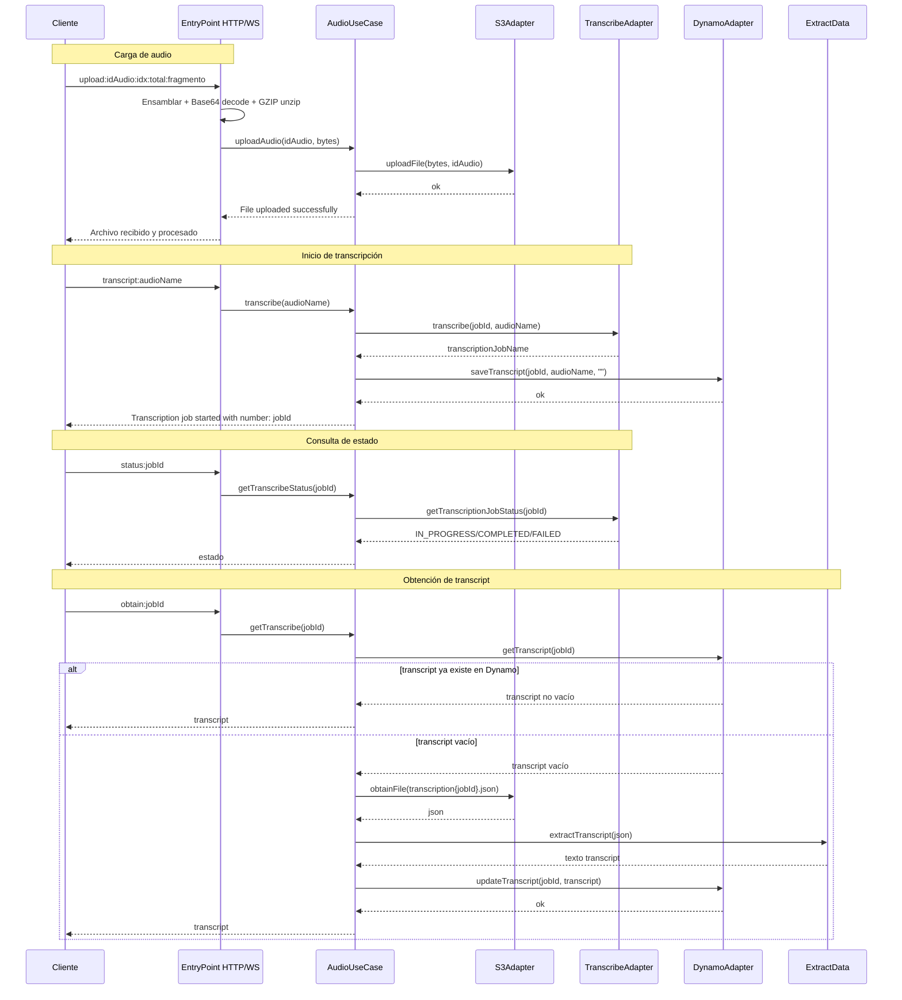
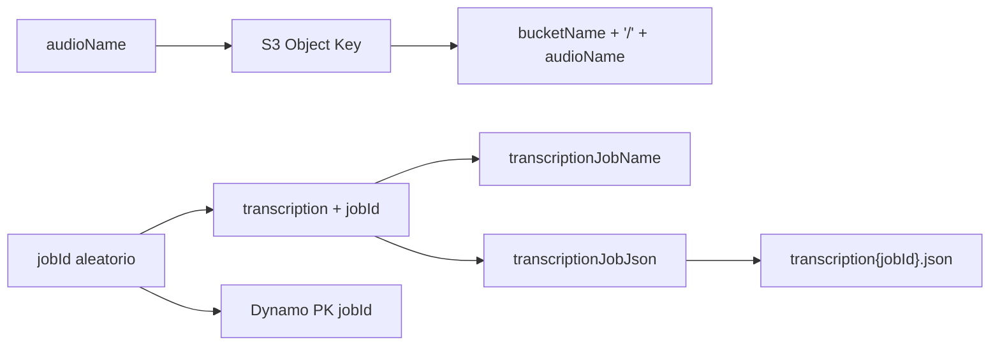
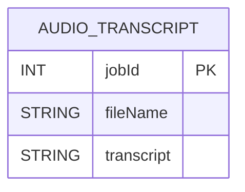

# Diagramas del microservicio

## Diagrama de Arquitectura General

```mermaid
graph TD
    Client[Cliente Web/Mobile]

    subgraph EntryPoints
        HTTP[Reactive HTTP Router]
        WS[WebSocket Transcription Handler]
    end

    subgraph Domain
        UC[AudioUseCase]
        P1[TranscribeGateway]
        P2[S3Gateway]
        P3[DynamoGateway]
        P4[ZipDecodeGateway]
    end

    subgraph Adapters
        A1[Transcribe Adapter]
        A2[S3 Adapter]
        A3[DynamoDB Adapter]
        H1[ExtractData Helper]
        H2[FragmentUtil Helper]
    end

    subgraph AWS
        S3[(S3 Bucket)]
        DDB[(DynamoDB Table)]
        TR[AWS Transcribe]
    end

    Client --> HTTP
    Client --> WS
    WS --> H2
    HTTP --> UC
    WS --> UC
    UC --> P1
    UC --> P2
    UC --> P3
    UC --> P4
    P1 --> A1 --> TR
    P2 --> A2 --> S3
    P3 --> A3 --> DDB
    A2 --> H1
```

## Diagrama de Secuencia Detallado

```mermaid
sequenceDiagram
    participant C as Cliente
    participant EP as EntryPoint HTTP/WS
    participant U as AudioUseCase
    participant S3 as S3Adapter
    participant T as TranscribeAdapter
    participant D as DynamoAdapter
    participant E as ExtractData

    Note over C,EP: Carga de audio
    C->>EP: upload:idAudio:idx:total:fragmento
    EP->>EP: Ensamblar + Base64 decode + GZIP unzip
    EP->>U: uploadAudio(idAudio, bytes)
    U->>S3: uploadFile(bytes, idAudio)
    S3-->>U: ok
    U-->>EP: File uploaded successfully
    EP-->>C: Archivo recibido y procesado

    Note over C,T: Inicio de transcripción
    C->>EP: transcript:audioName
    EP->>U: transcribe(audioName)
    U->>T: transcribe(jobId, audioName)
    T-->>U: transcriptionJobName
    U->>D: saveTranscript(jobId, audioName, "")
    D-->>U: ok
    U-->>C: Transcription job started with number: jobId

    Note over C,T: Consulta de estado
    C->>EP: status:jobId
    EP->>U: getTranscribeStatus(jobId)
    U->>T: getTranscriptionJobStatus(jobId)
    T-->>U: IN_PROGRESS/COMPLETED/FAILED
    U-->>C: estado

    Note over C,E: Obtención de transcript
    C->>EP: obtain:jobId
    EP->>U: getTranscribe(jobId)
    U->>D: getTranscript(jobId)
    alt transcript ya existe en Dynamo
        D-->>U: transcript no vacío
        U-->>C: transcript
    else transcript vacío
        D-->>U: transcript vacío
        U->>S3: obtainFile(transcription{jobId}.json)
        S3-->>U: json
        U->>E: extractTranscript(json)
        E-->>U: texto transcript
        U->>D: updateTranscript(jobId, transcript)
        D-->>U: ok
        U-->>C: transcript
    end
```

## Diagrama de Construcción de Llaves

```mermaid
graph LR
    A[audioName] --> B[S3 Object Key]
    B --> C[bucketName + '/' + audioName]

    D[jobId aleatorio] --> E[transcription + jobId]
    E --> F[transcriptionJobName]
    E --> G[transcriptionJobJson]
    G --> H["transcription{jobId}.json"]

    D --> I[Dynamo PK jobId]
```

## Modelo de Datos (ER)

```mermaid
erDiagram
    AUDIO_TRANSCRIPT {
        INT jobId PK
        STRING fileName
        STRING transcript
    }
```
